# Diagramas de Base de Datos - FleetTrackPro

Este documento contiene la representación visual de cada uno de los esquemas (schemas) de la base de datos de FleetTrackPro y un **Diagrama Global** unificado que los interconecta a todos.

Las imágenes PNG están guardadas dentro de la carpeta `diagrams/` del proyecto.

---

## 🌎 Diagrama Global Unificado (Cross-Schema)

Este diagrama muestra cómo interactúan las **44 tablas** de los 8 esquemas de la base de datos. Se omitieron algunos campos secundarios para enfocar la vista en las claves primarias (PK), foráneas (FK) y relaciones estructurales globales.

Aquí puedes ver claramente cómo `security.tipo_documento` se conecta con `employees.conductores`, y cómo `companies.empresas` sirve de pivote central para toda la plataforma (Multitenancy).

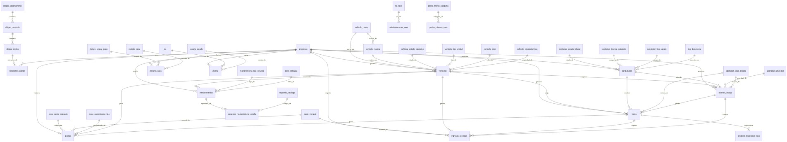

Ver Código Mermaid del Diagrama Global

```mermaid
erDiagram
    %% companies
    empresa_saas_plan {
        integer id_saas_plan PK
        varchar nombre_plan
    }
    empresa_suscripcion_estado {
        integer id_suscripcion_estado PK
        varchar nombre_estado
    }
    empresas {
        varchar id_empresa PK
        varchar ruc_tax_id
        varchar razon_social
    }
    ubigeo_departamento {
        varchar id_departamento PK
        varchar nombre_departamento
    }
    ubigeo_provincia {
        varchar id_provincia PK
        varchar id_departamento FK
        varchar nombre_provincia
    }
    ubigeo_distrito {
        varchar id_distrito PK
        varchar id_provincia FK
        varchar nombre_distrito
    }

    %% costs
    costo_comprobante_tipo {
        integer id_comprobante_tipo PK
        varchar nombre_comprobante
    }
    costo_gasto_categoria {
        integer id_gasto_categoria PK
        varchar nombre_categoria
    }
    costo_moneda {
        integer id_moneda PK
        varchar codigo_iso
    }
    gastos {
        integer id_gasto PK
        integer id_vehiculo FK
        integer id_viaje FK
        integer id_gasto_categoria FK
        integer id_moneda FK
        integer id_comprobante_tipo FK
        varchar id_empresa FK
    }
    ingresos_servicios {
        integer id_ingreso PK
        integer id_orden_trabajo FK
        integer id_vehiculo FK
        integer id_moneda FK
        varchar id_empresa FK
        integer id_viaje FK
    }

    %% employees
    conductor_estado_laboral {
        integer id_estado_laboral PK
        varchar nombre_estado
    }
    conductor_licencia_categoria {
        integer id_categoria PK
        varchar codigo_categoria
    }
    conductor_tipo_sangre {
        integer id_tipo_sangre PK
        varchar grupo_sanguineo
    }
    conductores {
        integer id_conductor PK
        integer id_estado_laboral FK
        integer id_categoria FK
        integer id_tipo_sangre FK
        varchar id_empresa FK
        integer id_tipo_documento FK
    }

    %% fleet
    sucursales_garitas {
        varchar id_sucursal PK
        varchar id_empresa FK
        varchar id_distrito FK
    }
    vehiculo_color {
        integer id_color PK
        varchar nombre_color
    }
    vehiculo_estado_operativo {
        integer id_estado_operativo PK
        varchar nombre_estado
    }
    vehiculo_marca {
        integer id_marca PK
        varchar nombre_marca
    }
    vehiculo_modelo {
        integer id_modelo PK
        integer id_marca FK
    }
    vehiculo_propiedad_tipo {
        integer id_propiedad_tipo PK
        varchar nombre_propiedad
    }
    vehiculo_tipo_unidad {
        integer id_tipo_unidad PK
        varchar nombre_tipo
    }
    vehiculos {
        integer id_vehiculo PK
        varchar placa
        integer id_marca FK
        integer id_modelo FK
        integer id_estado_operativo FK
        integer id_tipo_unidad FK
        integer id_color FK
        integer id_propiedad_tipo FK
        varchar id_empresa FK
    }

    %% maintenance
    mantenimiento_tipo_servicio {
        integer id_tipo_servicio PK
        varchar nombre_servicio
    }
    mantenimientos {
        integer id_mantenimiento PK
        integer id_vehiculo FK
        integer id_tipo_servicio FK
        varchar id_empresa FK
        integer id_taller FK
    }
    repuesto_catalogo {
        integer id_repuesto PK
        varchar codigo_repuesto
    }
    repuestos_mantenimiento_detalle {
        varchar id_detalle_repuesto PK
        integer id_mantenimiento FK
        varchar codigo_repuesto FK
    }
    taller_catalogo {
        integer id_taller PK
        varchar nombre_taller
    }

    %% operations
    checklist_inspeccion_viaje {
        varchar id_checklist PK
        integer id_viaje FK
    }
    operacion_prioridad {
        integer id_prioridad PK
        varchar nombre_prioridad
    }
    operacion_viaje_estado {
        integer id_viaje_estado PK
        varchar nombre_estado
    }
    ordenes_trabajo {
        integer id_orden_trabajo PK
        integer id_vehiculo FK
        integer id_conductor FK
        integer id_prioridad FK
        integer id_viaje_estado FK
        varchar id_empresa FK
    }
    viajes {
        integer id_viaje PK
        integer id_vehiculo FK
        integer id_conductor FK
        integer id_orden_trabajo FK
        integer id_viaje_estado FK
        varchar id_empresa FK
    }

    %% saas_admin
    rol_saas {
        integer id_rol_saas PK
        varchar nombre_rol
    }
    administradores_saas {
        integer id_admin PK
        integer id_rol_saas FK
    }
    factura_estado_pago {
        integer id_estado_pago PK
        varchar nombre_estado
    }
    metodo_pago {
        integer id_metodo_pago PK
        varchar nombre_metodo
    }
    facturas_saas {
        integer id_factura PK
        varchar id_empresa FK
        integer id_estado_pago FK
        integer id_metodo_pago FK
    }
    gasto_interno_categoria {
        integer id_categoria PK
        varchar nombre_categoria
    }
    gastos_internos_saas {
        integer id_gasto_interno PK
        integer id_categoria FK
    }

    %% security
    rol {
        integer id_rol PK
        varchar nombre_rol
    }
    tipo_documento {
        integer id_tipo_documento PK
        varchar codigo
        varchar nombre
    }
    usuario_estado {
        integer id_usuario_estado PK
        varchar nombre_estado
    }
    usuario {
        integer id_user PK
        integer id_rol FK
        integer id_usuario_estado FK
        varchar id_empresa FK
    }

    %% RELACIONES
    ubigeo_departamento ||--o{ ubigeo_provincia : "contiene"
    ubigeo_provincia ||--o{ ubigeo_distrito : "contiene"
    ubigeo_distrito ||--o{ sucursales_garitas : "ubicacion_de"

    empresas ||--o{ gastos : "registra"
    empresas ||--o{ ingresos_servicios : "registra"
    empresas ||--o{ conductores : "contrata"
    empresas ||--o{ sucursales_garitas : "posee"
    empresas ||--o{ vehiculos : "posee"
    empresas ||--o{ mantenimientos : "solicita"
    empresas ||--o{ ordenes_trabajo : "gestiona"
    empresas ||--o{ viajes : "gestiona"
    empresas ||--o{ facturas_saas : "factura"
    empresas ||--o{ usuario : "tiene"

    costo_gasto_categoria ||--o{ gastos : "categoriza"
    costo_moneda ||--o{ gastos : "moneda_de"
    costo_comprobante_tipo ||--o{ gastos : "comprobante_de"
    costo_moneda ||--o{ ingresos_servicios : "moneda_de"

    conductor_estado_laboral ||--o{ conductores : "estado_de"
    conductor_licencia_categoria ||--o{ conductores : "categoria_de"
    conductor_tipo_sangre ||--o{ conductores : "sangre_de"
    tipo_documento ||--o{ conductores : "tipo_doc_de"

    vehiculo_marca ||--o{ vehiculo_modelo : "marca_de"
    vehiculo_marca ||--o{ vehiculos : "marca_de"
    vehiculo_modelo ||--o{ vehiculos : "modelo_de"
    vehiculo_estado_operativo ||--o{ vehiculos : "estado_de"
    vehiculo_tipo_unidad ||--o{ vehiculos : "tipo_de"
    vehiculo_color ||--o{ vehiculos : "color_de"
    vehiculo_propiedad_tipo ||--o{ vehiculos : "propiedad_de"

    vehiculos ||--o{ gastos : "gasta"
    vehiculos ||--o{ ingresos_servicios : "genera"
    vehiculos ||--o{ mantenimientos : "mantenido"
    vehiculos ||--o{ ordenes_trabajo : "asignado"
    vehiculos ||--o{ viajes : "viaja"

    mantenimiento_tipo_servicio ||--o{ mantenimientos : "tipo_de"
    taller_catalogo ||--o{ mantenimientos : "taller_de"
    mantenimientos ||--o{ repuestos_mantenimiento_detalle : "repuestos_de"
    repuesto_catalogo ||--o{ repuestos_mantenimiento_detalle : "codigo_de"

    conductores ||--o{ ordenes_trabajo : "atiende"
    conductores ||--o{ viajes : "conduce"

    operacion_prioridad ||--o{ ordenes_trabajo : "prioridad_de"
    operacion_viaje_estado ||--o{ ordenes_trabajo : "estado_de"
    operacion_viaje_estado ||--o{ viajes : "estado_de"
    ordenes_trabajo ||--o{ viajes : "genera"
    viajes ||--o{ checklist_inspeccion_viaje : "inspecciona"
    viajes ||--o{ gastos : "gasta"
    viajes ||--o{ ingresos_servicios : "ingreso"
    ordenes_trabajo ||--o{ ingresos_servicios : "ingreso"

    rol_saas ||--o{ administradores_saas : "rol_de"
    factura_estado_pago ||--o{ facturas_saas : "estado_de"
    metodo_pago ||--o{ facturas_saas : "metodo_de"
    gasto_interno_categoria ||--o{ gastos_internos_saas : "categoria_de"

    rol ||--o{ usuario : "rol_de"
    usuario_estado ||--o{ usuario : "estado_de"
```

---

## 1. Esquema `companies` (Empresas y Ubicación)

Contiene la información de las empresas cliente registradas en el SaaS, planes de suscripción y tablas de datos geográficos (Ubigeo de Perú).

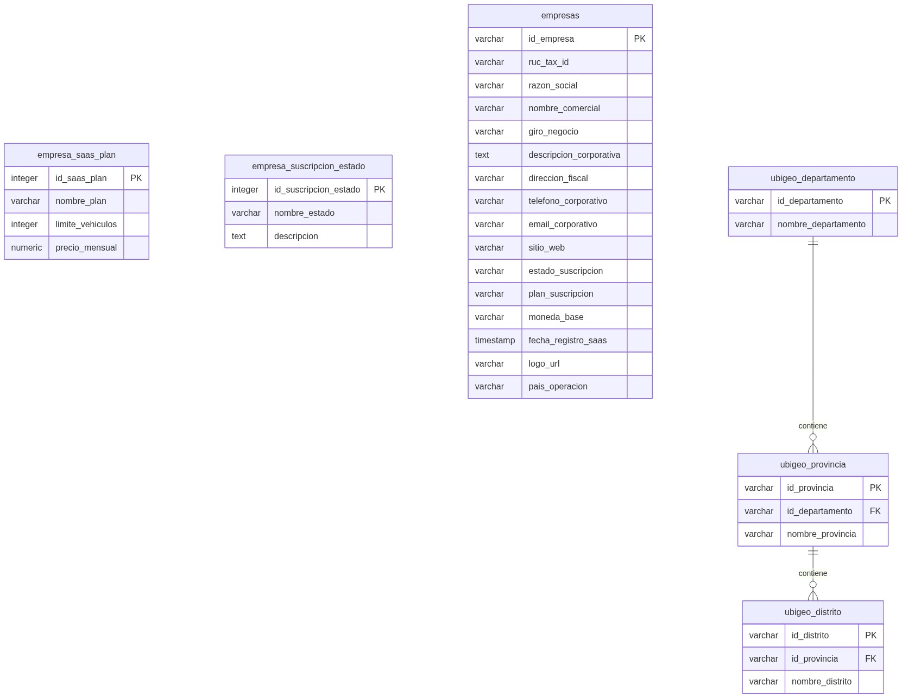

Ver Código Mermaid

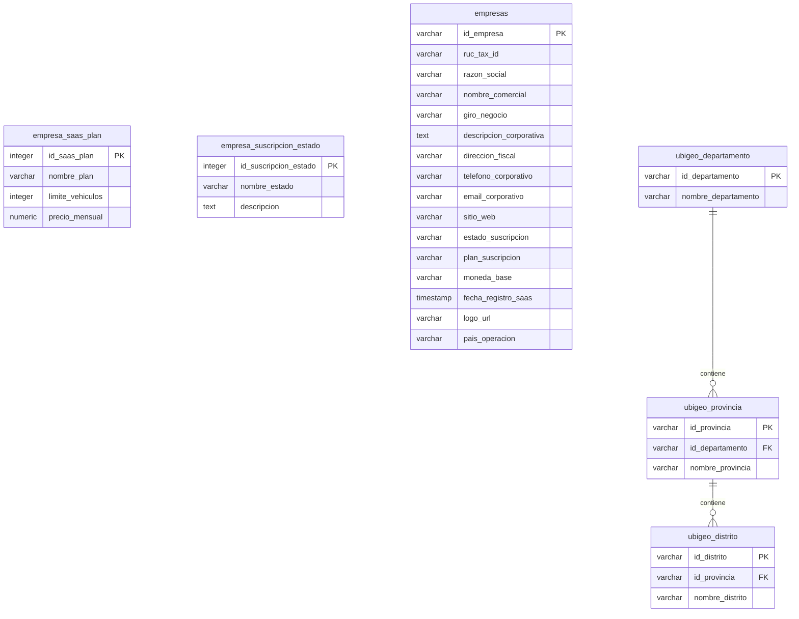
```mermaid
erDiagram
    empresa_saas_plan {
        integer id_saas_plan PK
        varchar nombre_plan
        integer limite_vehiculos
        numeric precio_mensual
    }
    
    empresa_suscripcion_estado {
        integer id_suscripcion_estado PK
        varchar nombre_estado
        text descripcion
    }

    empresas {
        varchar id_empresa PK
        varchar ruc_tax_id
        varchar razon_social
        varchar nombre_comercial
        varchar giro_negocio
        text descripcion_corporativa
        varchar direccion_fiscal
        varchar telefono_corporativo
        varchar email_corporativo
        varchar sitio_web
        varchar estado_suscripcion
        varchar plan_suscripcion
        varchar moneda_base
        timestamp fecha_registro_saas
        varchar logo_url
        varchar pais_operacion
    }

    ubigeo_departamento {
        varchar id_departamento PK
        varchar nombre_departamento
    }

    ubigeo_provincia {
        varchar id_provincia PK
        varchar id_departamento FK
        varchar nombre_provincia
    }

    ubigeo_distrito {
        varchar id_distrito PK
        varchar id_provincia FK
        varchar nombre_distrito
    }

    ubigeo_departamento ||--o{ ubigeo_provincia : "contiene"
    ubigeo_provincia ||--o{ ubigeo_distrito : "contiene"
```

---

## 2. Esquema `costs` (Costos y Finanzas)

Registra todos los ingresos generados por los viajes y servicios, así como los egresos categorizados (gastos de combustible, peajes, etc.).

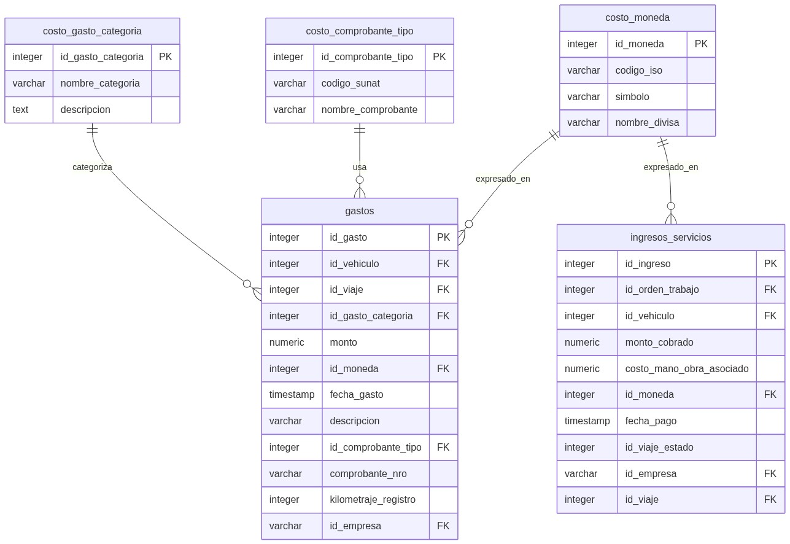

Ver Código Mermaid

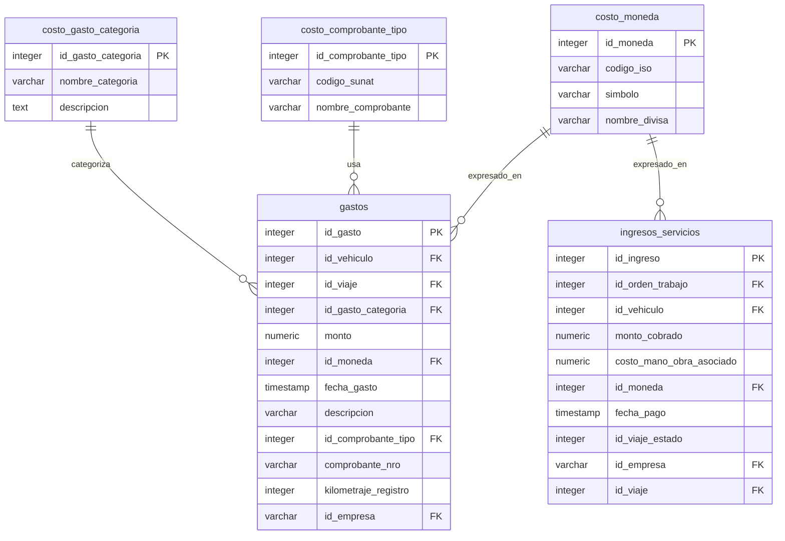
```mermaid
erDiagram
    costo_comprobante_tipo {
        integer id_comprobante_tipo PK
        varchar codigo_sunat
        varchar nombre_comprobante
    }

    costo_gasto_categoria {
        integer id_gasto_categoria PK
        varchar nombre_categoria
        text descripcion
    }

    costo_moneda {
        integer id_moneda PK
        varchar codigo_iso
        varchar simbolo
        varchar nombre_divisa
    }

    gastos {
        integer id_gasto PK
        integer id_vehiculo FK
        integer id_viaje FK
        integer id_gasto_categoria FK
        numeric monto
        integer id_moneda FK
        timestamp fecha_gasto
        varchar descripcion
        integer id_comprobante_tipo FK
        varchar comprobante_nro
        integer kilometraje_registro
        varchar id_empresa FK
    }

    ingresos_servicios {
        integer id_ingreso PK
        integer id_orden_trabajo FK
        integer id_vehiculo FK
        numeric monto_cobrado
        numeric costo_mano_obra_asociado
        integer id_moneda FK
        timestamp fecha_pago
        integer id_viaje_estado
        varchar id_empresa FK
        integer id_viaje FK
    }

    costo_gasto_categoria ||--o{ gastos : "categoriza"
    costo_moneda ||--o{ gastos : "expresado_en"
    costo_comprobante_tipo ||--o{ gastos : "usa"
    costo_moneda ||--o{ ingresos_servicios : "expresado_en"
```

---

## 3. Esquema `employees` (Personal / Conductores)

Administra los registros del personal de conducción, licencias de conducir y categorías de salud/laborales.

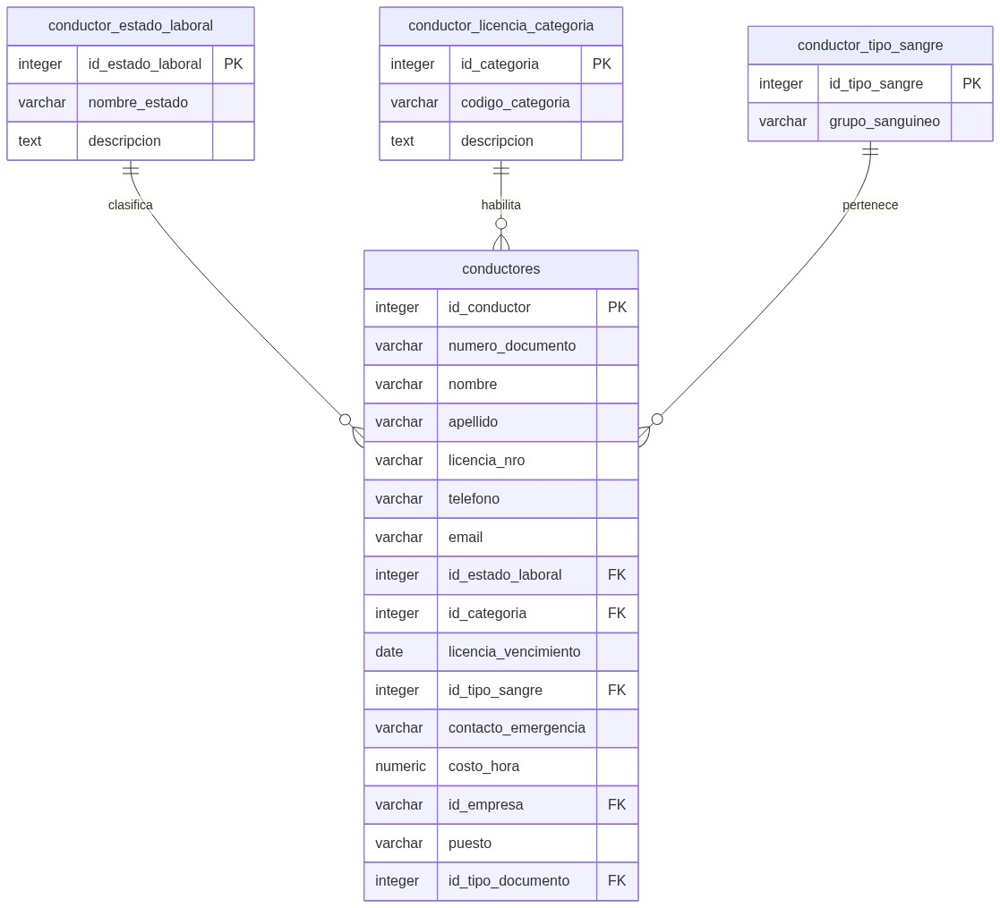

Ver Código Mermaid

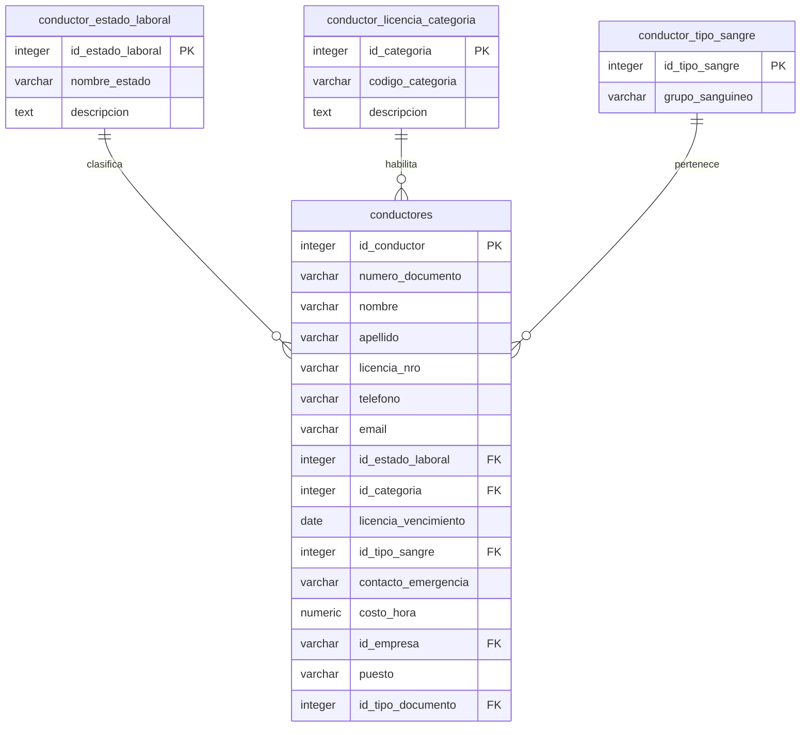
```mermaid
erDiagram
    conductor_estado_laboral {
        integer id_estado_laboral PK
        varchar nombre_estado
        text descripcion
    }

    conductor_licencia_categoria {
        integer id_categoria PK
        varchar codigo_categoria
        text descripcion
    }

    conductor_tipo_sangre {
        integer id_tipo_sangre PK
        varchar grupo_sanguineo
    }

    conductores {
        integer id_conductor PK
        varchar numero_documento
        varchar nombre
        varchar apellido
        varchar licencia_nro
        varchar telefono
        varchar email
        integer id_estado_laboral FK
        integer id_categoria FK
        date licencia_vencimiento
        integer id_tipo_sangre FK
        varchar contacto_emergencia
        numeric costo_hora
        varchar id_empresa FK
        varchar puesto
        integer id_tipo_documento FK
    }

    conductor_estado_laboral ||--o{ conductores : "clasifica"
    conductor_licencia_categoria ||--o{ conductores : "habilita"
    conductor_tipo_sangre ||--o{ conductores : "pertenece"
```

---

## 4. Esquema `fleet` (Flota de Vehículos)

Almacena la información de los vehículos, marcas, modelos, estados operativos e información logística de sucursales/garitas.

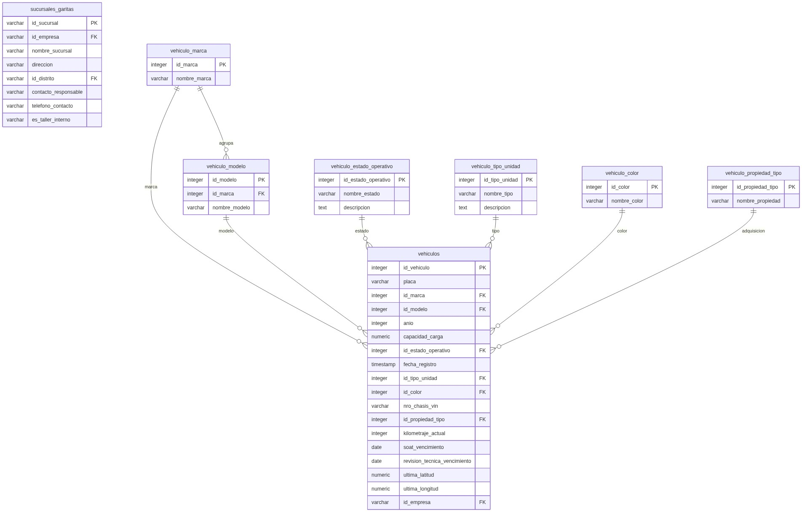

Ver Código Mermaid

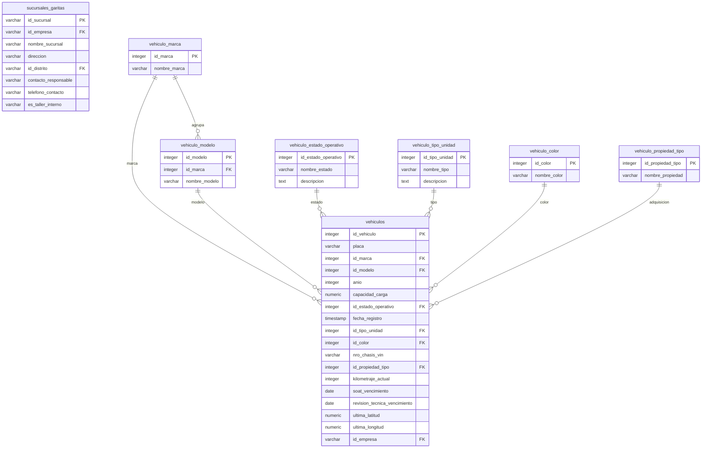
```mermaid
erDiagram
    sucursales_garitas {
        varchar id_sucursal PK
        varchar id_empresa FK
        varchar nombre_sucursal
        varchar direccion
        varchar id_distrito FK
        varchar contacto_responsable
        varchar telefono_contacto
        varchar es_taller_interno
    }

    vehiculo_color {
        integer id_color PK
        varchar nombre_color
    }

    vehiculo_estado_operativo {
        integer id_estado_operativo PK
        varchar nombre_estado
        text descripcion
    }

    vehiculo_marca {
        integer id_marca PK
        varchar nombre_marca
    }

    vehiculo_modelo {
        integer id_modelo PK
        integer id_marca FK
        varchar nombre_modelo
    }

    vehiculo_propiedad_tipo {
        integer id_propiedad_tipo PK
        varchar nombre_propiedad
    }

    vehiculo_tipo_unidad {
        integer id_tipo_unidad PK
        varchar nombre_tipo
        text descripcion
    }

    vehiculos {
        integer id_vehiculo PK
        varchar placa
        integer id_marca FK
        integer id_modelo FK
        integer anio
        numeric capacidad_carga
        integer id_estado_operativo FK
        timestamp fecha_registro
        integer id_tipo_unidad FK
        integer id_color FK
        varchar nro_chasis_vin
        integer id_propiedad_tipo FK
        integer kilometraje_actual
        date soat_vencimiento
        date revision_tecnica_vencimiento
        numeric ultima_latitud
        numeric ultima_longitud
        varchar id_empresa FK
    }

    vehiculo_marca ||--o{ vehiculo_modelo : "agrupa"
    vehiculo_marca ||--o{ vehiculos : "marca"
    vehiculo_modelo ||--o{ vehiculos : "modelo"
    vehiculo_estado_operativo ||--o{ vehiculos : "estado"
    vehiculo_tipo_unidad ||--o{ vehiculos : "tipo"
    vehiculo_color ||--o{ vehiculos : "color"
    vehiculo_propiedad_tipo ||--o{ vehiculos : "adquisicion"
```

---

## 5. Esquema `maintenance` (Mantenimiento)

Controla los mantenimientos preventivos y correctivos aplicados a los vehículos, detalles de repuestos utilizados y catálogo de talleres.

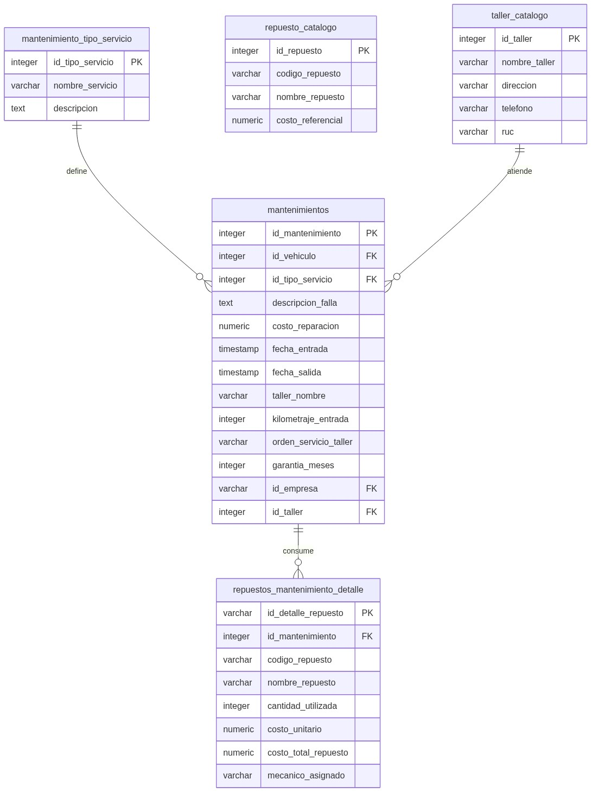

Ver Código Mermaid

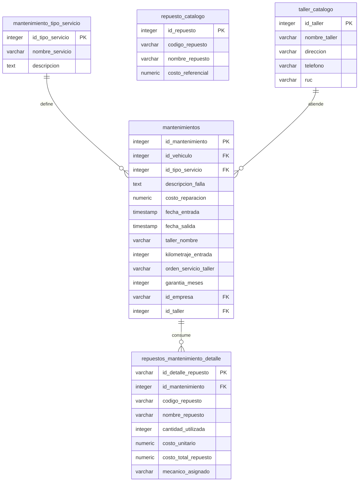
```mermaid
erDiagram
    mantenimiento_tipo_servicio {
        integer id_tipo_servicio PK
        varchar nombre_servicio
        text descripcion
    }

    mantenimientos {
        integer id_mantenimiento PK
        integer id_vehiculo FK
        integer id_tipo_servicio FK
        text descripcion_falla
        numeric costo_reparacion
        timestamp fecha_entrada
        timestamp fecha_salida
        varchar taller_nombre
        integer kilometraje_entrada
        varchar orden_servicio_taller
        integer garantia_meses
        varchar id_empresa FK
        integer id_taller FK
    }

    repuesto_catalogo {
        integer id_repuesto PK
        varchar codigo_repuesto
        varchar nombre_repuesto
        numeric costo_referencial
    }

    repuestos_mantenimiento_detalle {
        varchar id_detalle_repuesto PK
        integer id_mantenimiento FK
        varchar codigo_repuesto
        varchar nombre_repuesto
        integer cantidad_utilizada
        numeric costo_unitario
        numeric costo_total_repuesto
        varchar mecanico_asignado
    }

    taller_catalogo {
        integer id_taller PK
        varchar nombre_taller
        varchar direccion
        varchar telefono
        varchar ruc
    }

    mantenimiento_tipo_servicio ||--o{ mantenimientos : "define"
    taller_catalogo ||--o{ mantenimientos : "atiende"
    mantenimientos ||--o{ repuestos_mantenimiento_detalle : "consume"
```

---

## 6. Esquema `operations` (Operaciones y Viajes)

Gestiona la planeación de las órdenes de trabajo, el despacho de viajes y los checklists de inspección vehicular previos al viaje.

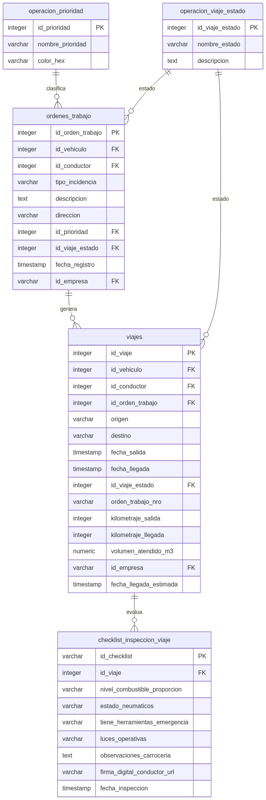

Ver Código Mermaid

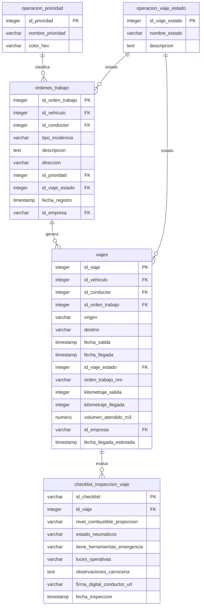
```mermaid
erDiagram
    checklist_inspeccion_viaje {
        varchar id_checklist PK
        integer id_viaje FK
        varchar nivel_combustible_proporcion
        varchar estado_neumaticos
        varchar tiene_herramientas_emergencia
        varchar luces_operativas
        text observaciones_carroceria
        varchar firma_digital_conductor_url
        timestamp fecha_inspeccion
    }

    operacion_prioridad {
        integer id_prioridad PK
        varchar nombre_prioridad
        varchar color_hex
    }

    operacion_viaje_estado {
        integer id_viaje_estado PK
        varchar nombre_estado
        text descripcion
    }

    ordenes_trabajo {
        integer id_orden_trabajo PK
        integer id_vehiculo FK
        integer id_conductor FK
        varchar tipo_incidencia
        text descripcion
        varchar direccion
        integer id_prioridad FK
        integer id_viaje_estado FK
        timestamp fecha_registro
        varchar id_empresa FK
    }

    viajes {
        integer id_viaje PK
        integer id_vehiculo FK
        integer id_conductor FK
        integer id_orden_trabajo FK
        varchar origen
        varchar destino
        timestamp fecha_salida
        timestamp fecha_llegada
        integer id_viaje_estado FK
        varchar orden_trabajo_nro
        integer kilometraje_salida
        integer kilometraje_llegada
        numeric volumen_atendido_m3
        varchar id_empresa FK
        timestamp fecha_llegada_estimada
    }

    operacion_prioridad ||--o{ ordenes_trabajo : "clasifica"
    operacion_viaje_estado ||--o{ ordenes_trabajo : "estado"
    operacion_viaje_estado ||--o{ viajes : "estado"
    ordenes_trabajo ||--o{ viajes : "genera"
    viajes ||--o{ checklist_inspeccion_viaje : "evalua"
```

---

## 7. Esquema `saas_admin` (Administración del SaaS)

Permite gestionar la administración global de la plataforma, roles de administración central, facturación periódica a las empresas registradas y el registro de costos del SaaS.

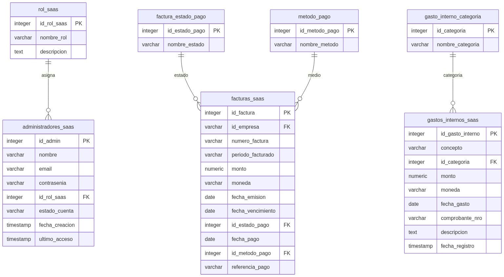

Ver Código Mermaid

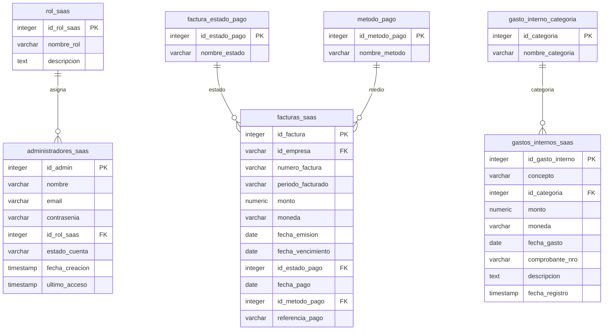
```mermaid
erDiagram
    rol_saas {
        integer id_rol_saas PK
        varchar nombre_rol
        text descripcion
    }

    administradores_saas {
        integer id_admin PK
        varchar nombre
        varchar email
        varchar contrasenia
        integer id_rol_saas FK
        varchar estado_cuenta
        timestamp fecha_creacion
        timestamp ultimo_acceso
    }

    factura_estado_pago {
        integer id_estado_pago PK
        varchar nombre_estado
    }

    metodo_pago {
        integer id_metodo_pago PK
        varchar nombre_metodo
    }

    facturas_saas {
        integer id_factura PK
        varchar id_empresa FK
        varchar numero_factura
        varchar periodo_facturado
        numeric monto
        varchar moneda
        date fecha_emision
        date fecha_vencimiento
        integer id_estado_pago FK
        date fecha_pago
        integer id_metodo_pago FK
        varchar referencia_pago
    }

    gasto_interno_categoria {
        integer id_categoria PK
        varchar nombre_categoria
    }

    gastos_internos_saas {
        integer id_gasto_interno PK
        varchar concepto
        integer id_categoria FK
        numeric monto
        varchar moneda
        date fecha_gasto
        varchar comprobante_nro
        text descripcion
        timestamp fecha_registro
    }

    rol_saas ||--o{ administradores_saas : "asigna"
    factura_estado_pago ||--o{ facturas_saas : "estado"
    metodo_pago ||--o{ facturas_saas : "medio"
    gasto_interno_categoria ||--o{ gastos_internos_saas : "categoria"
```

---

## 8. Esquema `security` (Seguridad y Acceso)

Define el control de accesos, roles empresariales, usuarios del sistema y sus respectivos estados.

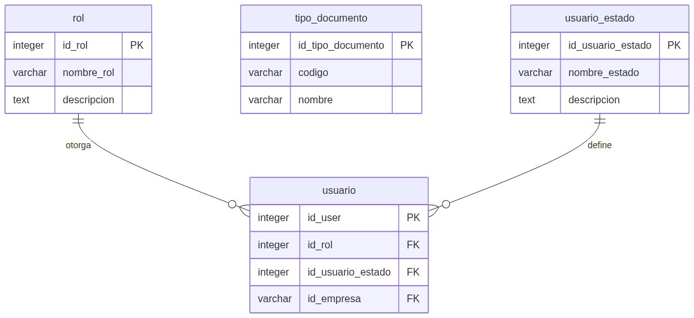

Ver Código Mermaid

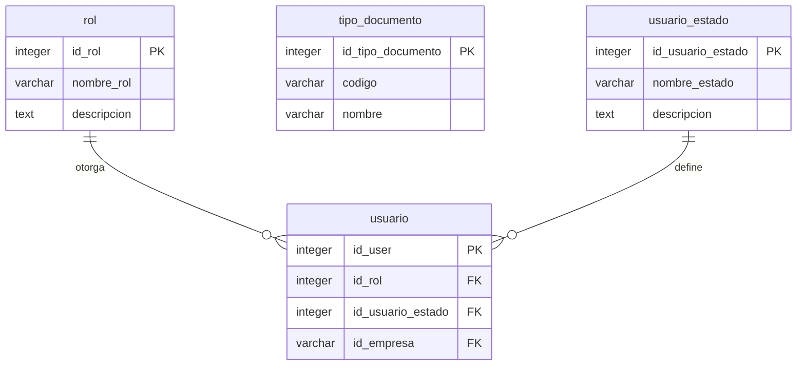
```mermaid
erDiagram
    rol {
        integer id_rol PK
        varchar nombre_rol
        text descripcion
    }

    tipo_documento {
        integer id_tipo_documento PK
        varchar codigo
        varchar nombre
    }

    usuario_estado {
        integer id_usuario_estado PK
        varchar nombre_estado
        text descripcion
    }

    usuario {
        integer id_user PK
        integer id_rol FK
        integer id_usuario_estado FK
        varchar id_empresa FK
    }

    rol ||--o{ usuario : "otorga"
    usuario_estado ||--o{ usuario : "define"
```

